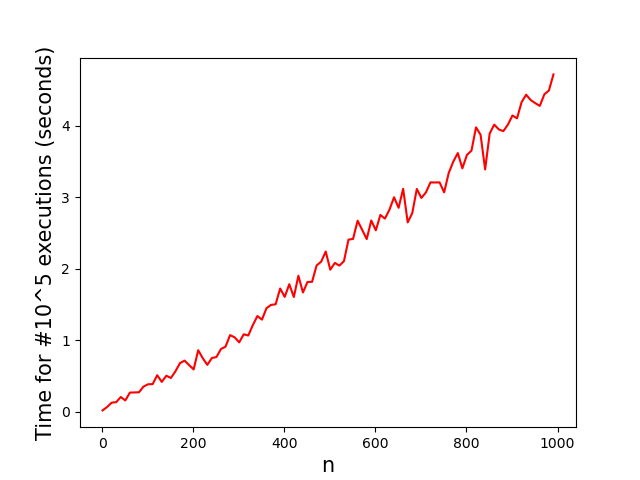
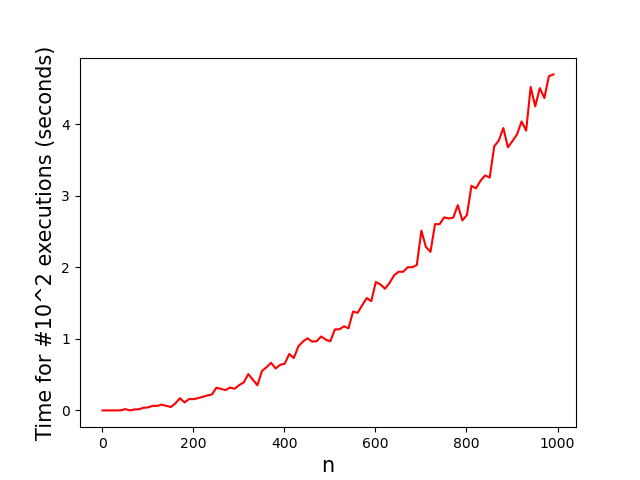
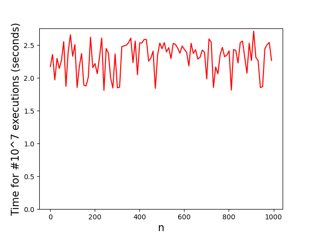

{::comment}
The script line below uses a cdn to get mathjax for neatly rendering latex math.
{:/comment}

This content was created in my role as a teacher for the [Scientific Programming Course at the University of Amsterdam](https://github.com/spcourse).

---

# Efficiency

In the exercises until now, you have probably noticed that there are often many different ways to solve a coding problem. While there is usually no *objectively best* solution, there are still ways to compare why one solution might be more useful than another. A few ways to compare code include;

1. Some approaches might have fewer lines than others (this is not always a good thing!).
2. Some approaches might be more easily readable, requiring less documentation to understand.
3. Some approaches might take less computations than others, producing the same solution in less time.

Each of these criteria is different, and some might be more important than others in different contexts. In this chapter, we will focus on the last criterium, that of time efficiency. How can we best measure how fast a piece of code is? And what does that teach us about how to write faster code?

# The stopwatch method isn't good enough

Let's say we have a piece of code, and we want to know how fast it is. The obvious way to do this is to take a stopwatch, run the piece of code, and measure the time between the start and end of the code. In fact, there are some Python libraries that allow you to do this. However, while this can be an useful tool, in many cases it's not enough. There are several reasons why using a stopwatch can be a poor way to measure code efficiency.

1. The time your code takes might depend on the machine you are using to run the code. If you are working on MIT's supercomputer, your code will probably take less time than it would on your parents' old laptop. Ideally, we want to measure efficiency in a way that does not depend on the machine, a **machine-independent** method.

2. The time your code takes will depend on the **input size** of your problem. When we write code, we often want it to do different things when we change the input. A piece of code that sums all numbers from $$1$$ to $$10$$ is obviously going to take less time than summing all numbers from $$1$$ to $$10^9$$. So, we want to express efficiency **in terms of input size**.

3. You might have just gotten lucky. Imagine you want to solve a sudoku, and you write a piece of code that just keeps guessing numbers until the sudoku is solved. In general, this would be a very slow and inefficient way to solve sudokus. But in principle, you could just get lucky, and enter all the correct numbers in one try. Then the result from our stopwatch is not a good indication of the efficiency of the code. Ideally, we want a way to measure efficiency that **takes into account the worst possible case**.

4. The stopwatch-method doesn't explain **why** our code is slow. If we measure a piece of code we wrote, and it takes an hour to run, we may think this is too long. Then we want to change the code to run faster. But if we still don't know **why** the code takes so much time, we don't know what to change. It would be better to have a method for thinking about efficiency that also helps to decide how to change the code to be faster.

5. Finally, we want to be able to predict the execution time of code **before running it**. If a piece of code would take 32 years to run (we'll see an example of this later!), we want to know about that **before we run it**, so we can improve the code. The stopwatch method here wouldn't tell us *anything*, because after one day we would just give up and turn off our computer.

Lucky for us, there is a way of measuring efficiency that does all of these things! It's called **time complexity**, and denoted using **big-O notation** (pronounced 'big-oh'). In the next few paragraphs, you'll learn what time complexity is, and how to work with it. :)

# Time complexity and big-O notation

In order to understand time complexity, we're going to start with the stopwatch method, and slowly build up our intuition through a few examples.

## $$O(n)$$, linear time

Usually when we write a piece of code, we want it to do different things depending on the input. If the input changes, the execution time may also change. For this reason, when we measure the efficiency of a piece of code, we want to do so *as a function of the input size*. Consider the following example.

    def o_n_func(n):
        for i in range(n):
            x = i + 5

    n = 100
    o_n_func(n)

This piece of code calculates the value of $$i+5$$ for every number $$i$$ between $$0$$ and $$n$$. If $$n$$ is very small, this code has to do very few calculations. But if $$n$$ is big, the number of calculations increases as well. One way to study this, is to make a graph. Along the x-axis we will put $$n$$, the input size. And along the y-axis we will measure the time taken to run the code. Since computers are very fast, and small times are very hard to measure, we will re-run the code 100000 times for each value on $$n$$. That way we can be sure that we get accurate results. See the graph below:

{: width="400px"}

> The little peaks in the graph are from noise. While in theory computers are deterministic, in practice they are not! Little things like the temperature, energy supply, and processes running in the background can all have an effect on the time it takes to do a calculation. For our purposes this is not a huge issue; if we just run the code often enough, these will average out, and we can get a graph that is close to a smooth curve.

We see that as $$n$$ becomes larger, so does the time taken to run the code! This is because the function contains a for-loop up to $$n$$. As $$n$$ grows, the for-loop becomes longer, and we do more calculations. Since the graph is a linear function (a slanted line), we say that this code has a linear time complexity. We write this in big-O notation as: the code has time complexity $$O(n)$$ (pronounced 'big oh of en'). When the input size $$n$$ becomes twice as big, so does the time taken by the code.

The code for the example above is of course a bit silly; it doesn't really accomplish anything. But a lot of the algorithms you have seen in the course so far fall under the category of $$O(n)$$. Here are some example of algorithms with time complexity $$O(n)$$:

1. Summing all numbers from $$0$$ to $$n$$.
2. Finding the maximum/minimum in a list of length $$n$$.
3. Checking whether a given element is contained in a list of length $$n$$.
4. Creating a list with numbers from $$a$$ to $$b$$ with step-size $$\frac{b-a}{n}$$.
5. Approximating an integral with a Riemann sum, using $$n$$ terms.

Code examples of $$O(n)$$ algorithms

    # sum all numbers between 0 and n
    def sum_from_zero_to(n):
        sum = 0
        for i in range(n):
            sum += i
        return sum

    # find the index and value of the maximum element in a list
    def find_maximum(lst):
        max_index = None
        max_value = None

        for index in range(len(lst)):
            value = lst[index]
            if max_index == None or value > max_value:
                max_index = index
                max_value = value

        return max_index, max_value

    # check whether sought_element is contained in lst
    def find_element(lst, sought_element):
        found = False

        for element in lst:
            if element == sought_element:
                found = True

        return found

    # alternative way to define find_element (still O(n)!)
    def find_element_v2(lst, sought_element):
        if sought_element in lst:
            return True
        else:
            return False

    # create a list from a (inclusive) to b (exclusive) with given step_size
    def arange(a, b, step_size):
        value = a
        lst = []

        while value < b:
            lst.append(value)
            value += step_size

        return lst

    # calculate the riemann integral for a quadratic function with constants a, b, c
    def f(a, b, c, x):
        return a * x ** 2 + b * x + c

    def riemann(a, b, c, begin_x, end_x, n):
        delta_x = (end_x - begin_x) / n

        riemann_sum = 0
        for i in range(n):
            riemann_sum += delta_x * f(a, b, c, begin_x + delta_x * (i + 0.5))

        return riemann_sum

What most of these examples have in common is that they contain a single for-loop of length $$n$$. Usually, this is a good indicator that the algorithm is $$O(n)$$.

## $$O(n^2)$$, quadratic time

Let's do another example. Again, we will plot the runtime of the code against the input size $$n$$. Can you guess what the complexity will be of the following piece of code?

    def o_n2_func(n):
        for i in range(n):
            for j in range(n):
                x = i + j

    n = 100
    o_n2_func(n)

{: width="400px"}

As you can see in the graph, the execution time of the code looks like a quadratic function. Every time we double the input size $$n$$, the time taken to run the code goes up by a factor 4. This is because of the nested loop in the code. Every time the inner loop happens, we calculate $$n$$ different values. And every time the outer loop happens, it runs the inner loop $$n$$ times. This means the calculation of $$x$$ happens $$n * n = n^2$$ times. We say that this code has quadratic time complexity. We write this in big-O notation as: the code has time complexity $$O(n^2)$$.

## $$O(1)$$, constant time

In the previous sections we saw examples where the run-time depended on the input size $$n$$. But for some code, this is not the case! Consider the following piece of code.

    def o_1_func(n):
        x = n + math.sqrt(27) + math.sqrt(31)

    n = 100
    o_1_func(n)

{: width="400px"}

We see that the code roughly takes the same amount of time whenever we run it. Therefore, the time it takes is "constant"; it doesn't change depending on $$n$$. In this case we say this code has a "constant" time complexity. We write this in big-O notation as: the code has time complexity $$O(1)$$.

There are other time complexities as well, like $$O(log(n))$$, or $$O(n^3)$$, or even $$O(n!)$$. For right now, you don't need to know about these yet, though it is good to be aware more types of time complexity exist.

## Calculation example

Knowing the time complexity depending on $$n$$ is very important. In many real-world applications, computers and code are used to solve very big problems. It isn't rare to see cases where $$n$$ is as big as one billion! If $$n$$ is that large, the execution time might also become very long. To give you some intuition, consider the case that $$n = 10^6$$, one million. Then a piece of code with constant time complexity might take $$10^{-3}$$ seconds to run, one millisecond. But a piece of code with linear time complexity could take $$10^6 * 10^{-3} = 10^3$$ seconds to run, which is about 17 minutes. And a piece of code with quadratic time complexity could take a whole $$(10^6)^2 * 10^{-3} = 10^9$$ seconds, which is almost 32 years!

    n = 10**6

    def calculation():
        # do some calculation that takes 1 millisecond

    # this code takes 1 millisecond
    calculation()

    # this code takes 17 minutes
    for i in range(n):
        calculation()

    # this code takes 32 years
    for i in range(n):
        for j in range(n):
            calculation()

# Key take-aways so far

Okay, so what have we learned so far? We know that measuring the time-efficiency of your code is important. Small coding choices can make the difference between an algorithm that takes a few minutes to run, and one that takes many years to run. We learned about the stopwatch method of measuring efficiency of code, and that it's not always good enough by itself. And we learned about a different method of measuring efficiency, called time complexity. It uses a type of notation called big-O notation. And it separates code into different classes based on its behaviour. So far you've seen three: $$O(1)$$, $$O(n)$$, and $$O(n^2)$$. Of these, $$O(1)$$ usually means your code has great performance, and $$O(n)$$ means it has okay performance. But if your code has time complexity $$O(n^2)$$, it will quickly take huge amounts of time to run, especially as $$n$$ gets bigger! And finally; one important thing to pay attention to is the number of nested loops in your code. If there are a lot of nested loops, your code can quickly become very slow!

If all of that sounds like it makes sense to you, you're doing great so far! Next, we will discuss how to determine the time complexity of more realistic and complicated code.
